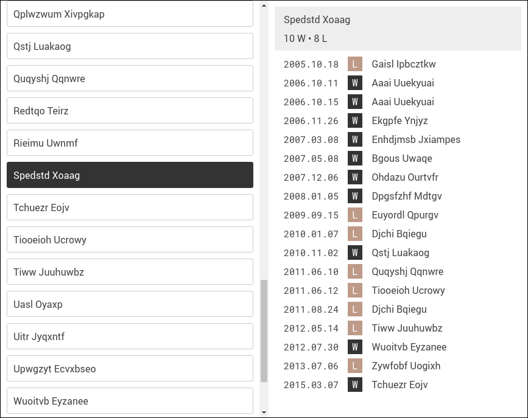

# Match history

## A web interface for browsing a player's match history

This package generates a web page displaying a player's match history
in a sport featuring two-player matches, such as tennis or chess.

### Current features

We randomly generate a set of player histories by running `gen.py`. The
resulting player names and histories are written to `js/data.js`. The
web page `index.html` displays an interface for browsing player histories.

